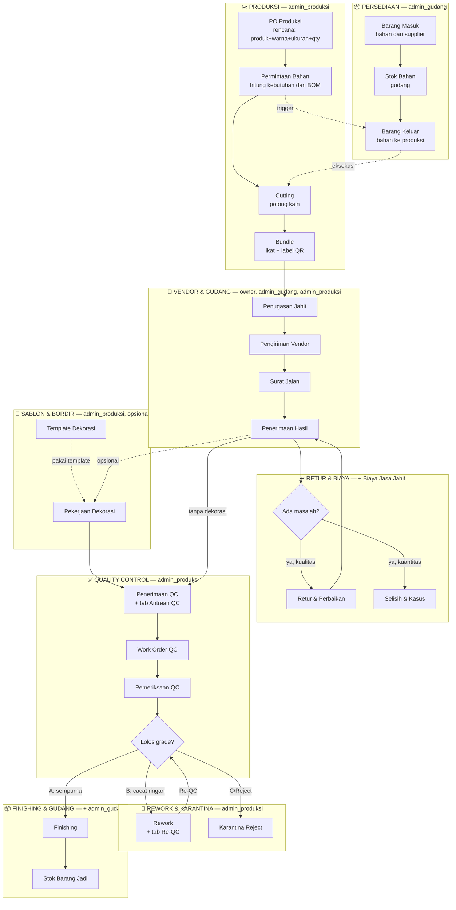

# Alur Proses & Menu — Flowchart

Peta alur produksi Owncrave, dipetakan ke nama menu sidebar persis (bukan istilah PRD).
Baca [`konsep-produksi.md`](konsep-produksi.md) untuk istilah domain (BOM, WIP, HPP, dll).

> Diperiksa ulang 22 Sep 2026 terhadap kode. Struktur menu di dokumen ini sempat
> basi setelah `app-z4wp` (menu digabung jadi tab) dan `app-qr6o` (sidebar disaring
> per role) — bagian itu sudah diperbarui. **Nama menu ≠ nama route**: banyak
> halaman lama kini jadi tab di dalam halaman gabungan.

---

## Flowchart Utama



---

## Cara Baca

1. **Persediaan** — bahan mentah masuk gudang, disimpan, lalu dikeluarkan untuk produksi. Modul ini yang paling sering dibuka harian.
2. **Produksi** — dimulai dari rencana (PO Produksi: mau bikin apa, warna, ukuran, qty), sistem hitung kebutuhan bahan (BOM) jadi **Permintaan Bahan** (dokumen minta ke gudang). Permintaan ini yang **memicu** Barang Keluar di Persediaan — bukan sebaliknya. Setelah bahan fisik diterima, baru Cutting (potong) jalan, hasil diikat jadi Bundle berlabel QR. Titik ini bahan **keluar dari kontrol internal**.
3. **Vendor & Gudang** — Bundle dikirim ke penjahit luar. Owncrave sendiri tidak menjahit. "Penerimaan Hasil" = baju jadi balik ke gudang internal. Kalau ada masalah kuantitas/kualitas → Retur atau catat di Selisih & Kasus.
4. **Sablon & Bordir** — opsional, hanya untuk item yang butuh dekorasi. Kalau tidak butuh, langsung ke QC.
5. **Quality Control** — tahap terakhir sebelum jadi stok final. Grade A lolos langsung, grade B masuk Rework lalu Re-QC (bisa berulang), grade C/Reject dikarantina (tidak dijual). Yang lolos → Finishing → Packing → **Stok Barang Jadi**.

**Inti kebingungan yang dijawab diagram ini**: barang **keluar-masuk gudang berkali-kali** (internal → vendor jahit → vendor sablon → QC internal), bukan sekali jalan seperti toko biasa. "Siap" di satu tahap belum berarti final — masih ada tahap berikut sampai ke Stok Barang Jadi.

**Persediaan dan Produksi bukan kerja paralel/bareng** — dua departemen beda yang saling nunggu, tetap sequential per unit kerja (PO → Permintaan Bahan → nunggu digudangkan → Barang Keluar → nunggu diterima → Cutting). Kelihatan seperti 2 kotak sejajar di diagram karena memang 2 tabel database beda yang saling rujuk, bukan 2 proses jalan bersamaan tanpa nunggu.

---

## Siapa Pegang Apa (Role)

Role diterapkan di **dua lapis**, dan keduanya nyata di kode:

1. **Server** — `requireRole()` per service (~70 titik panggil). Ini yang benar-benar memproteksi.
2. **Menu** — sidebar disaring per role lewat `navUntukRole()` (`src/components/layouts/sidebar/data/index.ts:263`), dipakai di sidebar desktop maupun bottom-nav mobile. Diselesaikan di `app-qr6o` (21 Sep 2026).

⚠️ **Menu tersembunyi bukan proteksi.** Tidak ada `middleware.ts` di proyek ini, dan
guard per halaman belum merata. User yang menunya disembunyikan tetap bisa membuka
URL-nya langsung. Lihat "Utang Teknis" di `CLAUDE.md`.

Akibat penyaringan menu: **menu bisa lebih ketat daripada server.** Contoh nyata —
grup Produksi kini `roles: ["owner", "admin_produksi"]` (index.ts:104), jadi
admin_gudang **tidak lagi melihat menu Permintaan Bahan**, padahal
`permintaan-bahan.ts` READ_ROLES masih mengizinkannya membaca. Ia hanya bisa
sampai ke sana lewat URL langsung.

| Role | Bisa CREATE/EDIT | Cuma bisa lihat |
|---|---|---|
| **owner** | Semua modul + approval | — |
| **admin_gudang** | Barang Masuk, Barang Keluar, Penyesuaian Stok | Permintaan Bahan, PO Produksi, dll (baca-saja) |
| **admin_produksi** | PO Produksi, Permintaan Bahan, WO Cutting, BOM, Penugasan Jahit, Dekorasi | Barang Masuk/Keluar (baca-saja — **tidak bisa** eksekusi sendiri) |
| **keuangan** | Tahap 5 (belum ada menu) | — |
| **viewer** | — | Semua modul, baca-saja |

**Kenapa dipisah begini (segregation of duty)**: yang **minta** bahan (admin_produksi) dan yang **kasih/eksekusi keluar** bahan (admin_gudang) harus 2 role beda — kalau 1 orang pegang dua-duanya, selisih stok gak ada kontrol silang.

**Alur konkret Permintaan Bahan → Barang Keluar** (terhubung otomatis via `barang_keluar.permintaan_bahan_id`, bukan input ulang manual):

```
admin_produksi: PO Produksi → submit Permintaan Bahan
                                    ↓
admin_gudang  : buka Barang Keluar → pilih permintaan itu → input qty keluar
                                    ↓
                Stok Bahan berkurang, status Permintaan Bahan → terpenuhi
```

Sejak sidebar disaring per role, admin_gudang **tidak melihat menu Permintaan
Bahan**; daftar permintaan yang menunggu ia temukan dari dalam form Barang
Keluar, bukan dari menu tersendiri.

**QC dipegang `admin_produksi`** — tidak ada role `admin_qc` khusus (`src/services/rework.ts` baris 26: `WRITE_ROLES = ["owner", "admin_produksi"]`).

⚠️ Idealnya QC dipegang staf terpisah dari produksi, dengan alasan yang sama seperti pemisahan Persediaan↔Produksi di atas: orang tidak menilai hasil kerjanya sendiri dengan jujur. Tapi kalau tim Owncrave kecil, perangkapan itu wajar — yang penting jejaknya tercatat. Ditanyakan ke klien di `app-x98y`.

---

## Struktur Menu Sebenarnya

Diperiksa 22 Sep 2026 dari `src/components/layouts/sidebar/data/index.ts`.
Setelah `app-z4wp`, **banyak menu lama jadi tab di dalam halaman gabungan** —
berkas route-nya masih ada di disk tapi tidak lagi ditunjuk sidebar.

| Grup sidebar | Isi | Role yang melihat |
|---|---|---|
| **Master Data** | Data Bahan, Data Produk, Data Mitra, Data QC | semua |
| **Persediaan** | Stok Bahan, Barang Masuk, Barang Keluar, Mutasi Stok, Penyesuaian Stok\* | semua (\*Penyesuaian: owner, admin_gudang) |
| **Produksi** | PO Produksi, Permintaan Bahan, Cutting, Bundle | owner, admin_produksi |
| **Vendor & Gudang** | Penugasan Jahit, Pengiriman Vendor, Surat Jalan, Penerimaan Hasil | owner, admin_gudang, admin_produksi |
| **Retur & Biaya** | Retur & Perbaikan, Selisih & Kasus, Biaya Jasa Jahit | owner, admin_gudang, admin_produksi, keuangan |
| **Sablon & Bordir** | Pekerjaan Dekorasi, Template Dekorasi | owner, admin_produksi |
| **Quality Control** | Penerimaan QC (+tab Antrean), Work Order QC, Pemeriksaan QC | owner, admin_gudang, admin_produksi |
| **Rework & Karantina** | Rework (+tab Re-QC), Karantina Reject | owner, admin_produksi |
| **Finishing & Gudang** | Finishing, Stok Barang Jadi | owner, admin_produksi, admin_gudang |
| **Monitoring** | WIP Produksi, WIP Jahit | owner, admin_produksi |
| **Laporan** | satu halaman bertab | semua |
| **Dokumentasi** | Panduan Pemakaian | semua |
| **Sistem** | Pengguna, Log Aktivitas, Pengaturan | owner |

**Yang dulu menu, sekarang tab:** Kategori, Satuan, Warna, Supplier, Kemasan,
Bagian Produk, Jenis Cacat, Gudang Jadi (→ 4 halaman Master Data); 5 laporan
(→ `/laporan`); Antrean QC (→ tab di Penerimaan QC); Re-QC (→ tab di Rework).

**Surat Jalan tetap menu sendiri** — rencana menggabungkannya ke Pengiriman
Vendor (`app-pbxe`) ditolak saat eksekusi `app-z4wp` karena melayani dua alur
sekaligus: pengiriman jahit dan dekorasi.

---

## Peta Tahap Sistem

| Menu Sidebar | Tahap PRD | Lihat juga |
|---|---|---|
| Persediaan | Tahap 1 | [`konsep-produksi.md`](konsep-produksi.md) §Tahapan Sistem |
| Produksi | Tahap 2 | — |
| Vendor & Gudang | Tahap 3 | — |
| Sablon & Bordir | Tahap 3 (dekorasi) | — |
| Quality Control | Tahap 4 | — |
| *(Keuangan, HPP)* | Tahap 5 | belum ada menu — akumulasi biaya tiap tahap di atas |

---

## Salah Paham yang Sering Terjadi

Dikumpulkan dari sesi pemahaman sistem 18 Sep 2026. Ini bagian yang paling
sering keliru dibaca — termasuk oleh AI yang menebak dari nama menu saja.

| Dugaan yang wajar | Kenyataannya |
|---|---|
| Mutasi Stok = ringkasan Barang Masuk/Keluar | Kebalikannya. Mutasi lebih **rinci** — satu nota masuk berisi 3 bahan jadi 3 baris mutasi. Yang ringkasan itu **Stok Bahan** (saldo akhir). |
| Barang Keluar memicu Permintaan Bahan | Kebalikannya. Permintaan Bahan ditulis dulu (oleh produksi), Barang Keluar yang menunjuk ke sana (`barang_keluar.permintaan_bahan_id`). |
| Permintaan Bahan = minta **beli** bahan | Bukan. Itu minta **ambil dari stok gudang** yang sudah ada. Pembelian ada di alur lain (Barang Masuk dari supplier). |
| Owncrave menjahit sendiri | Sebagian. Ada 6 jenis penjahit (`penjahitJenisEnum`, `schema.ts:147`): `internal`, `eksternal_individu`, `anggota_vendor`, `freelance`, `sampel`, `spesialis_perbaikan`. Jadi campuran, bukan semuanya vendor luar. |
| PO Produksi langsung menampilkan daftar bahan | Tidak. Isi PO = **varian produk** (SKU warna×ukuran) yang mau dibuat. Bahannya dihitung otomatis di halaman **detail PO** setelah disimpan ("Estimasi Kebutuhan Bahan"). |
| "Lebihan" itu satu konsep | Dua konsep beda bernama sama. Di Excel klien = sisa/cadangan **bahan aksesoris**; di form PO = buffer **produk jadi**. Lihat `app-itl4`. |
| Barang jadi setelah dijahit langsung masuk gudang | Tidak. Masih harus lewat QC (bisa berulang kalau kena Rework), baru Finishing → Packing → Stok Barang Jadi. |

---

## Selisih Model Sistem vs Model Klien

Dua sumber dari klien (gambar skema "Skema Aplikasi Stok Bahan & WIF Produksi"
dan app vibe-coding mereka sendiri) menunjukkan cara mereka memandang alurnya.
Berguna bukan sebagai "mana yang benar" — app klien bukan referensi kebenaran —
tapi sebagai cerminan **model mental** mereka, yang menentukan apakah sebuah
menu terasa wajar atau membingungkan saat dipakai.

| Hal | Model klien | OIMS sekarang |
|---|---|---|
| Urutan Sablon/Bordir | Berurutan: Bundling → Sablon → Penjahit | Bebas — dekorasi menunjuk ke WO Cutting, "urutan tidak dipaksa sistem" |
| Finishing/Packing/Stok Jadi | Di luar QC (kotak "Penerimaan Gudang" terpisah) | **Sudah sejalan** — grup "Finishing & Gudang" sendiri, terpisah dari Quality Control |
| Grup QC | Dua menu: "Quality Control" (jalur normal) + "Rework & Karantina" (jalur bermasalah) | **Sudah sejalan** — tiga grup: Quality Control, Rework & Karantina, Finishing & Gudang |
| Istilah dokumen produksi | **WIF** ("Buat WIF / Order Produksi") | **PO Produksi** |
| Penerimaan barang dari rework | Menu sendiri ("Penerimaan Rework") | Belum ketemu padanan eksplisit |

Semua baris di atas ditanyakan ke klien di `app-x98y` (**sudah terjawab**, 20-21 Sep
2026): QC tetap dipegang admin_produksi, urutan sablon tetap bebas, istilah tetap
"PO Produksi" bukan WIF. Dua keberatan lain — grup QC dan penempatan Finishing —
ikut terjawab sendiri oleh penataan menu di `app-z4wp`.

Yang **bukan** masalah meski tidak ada di gambar klien: Permintaan Bahan, Surat
Jalan, Selisih & Kasus, Biaya Jasa Jahit, Antrean QC, Karantina Reject. Gambar
itu ringkasan satu halaman, wajar memadatkan. Semuanya punya dasar di PRD —
Antrean QC disebut 6×, Rework 5×, Re-QC 8×, dan Barang Reject punya bab sendiri
(bab 18). Jadi sistem memang **harus** lebih rinci dari gambar.

---

## Issue Terkait — semuanya sudah selesai

Diperiksa 22 Sep 2026. Ketujuhnya closed; disimpan sebagai jejak kenapa struktur
sekarang begini, bukan sebagai daftar pekerjaan.

| ID | Isi | Hasilnya |
|---|---|---|
| `app-x98y` | Pertanyaan untuk klien: siapa yang periksa QC, urutan Sablon, istilah WIF/PO, penempatan Finishing/Packing | Terjawab, tanpa perubahan kode |
| `app-qr6o` | Sidebar tidak difilter per role | **Dikerjakan** — `navUntukRole()`, sidebar + bottom-nav |
| `app-jroq` | Matrix input Target per SKU di form PO Produksi | Dikerjakan |
| `app-itl4` | Field "Lebihan Pcs" — klien pernah minta atau tidak | Dilipat ke `app-1u2w` |
| `app-fbra` | Template Dekorasi tanpa peringatan kalau produk belum disetel | Dikerjakan — peringatan ditambahkan |
| `app-pbxe` | Gabung menu Surat Jalan jadi tab di Pengiriman Vendor | **Ditolak** saat eksekusi — Surat Jalan melayani dua alur |
| `app-z4wp.5` | Gabung 2 pasang menu QC jadi tab | Dikerjakan — Antrean→Penerimaan QC, Re-QC→Rework |
