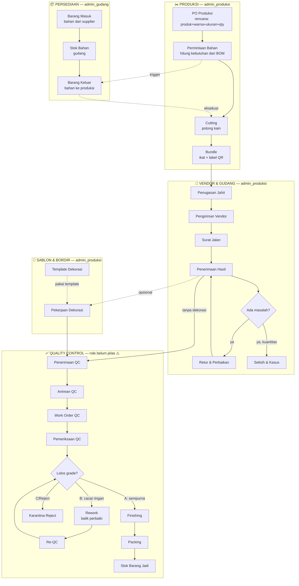

# Alur Proses & Menu — Flowchart

Peta alur produksi Owncrave, dipetakan ke nama menu sidebar persis (bukan istilah PRD).
Baca [`konsep-produksi.md`](konsep-produksi.md) untuk istilah domain (BOM, WIP, HPP, dll).

---

## Flowchart Utama



---

## Cara Baca

1. **Persediaan** — bahan mentah masuk gudang, disimpan, lalu dikeluarkan untuk produksi. Modul ini yang paling sering dibuka harian.
2. **Produksi** — dimulai dari rencana (PO Produksi: mau bikin apa, warna, ukuran, qty), sistem hitung kebutuhan bahan (BOM) jadi **Permintaan Bahan** (dokumen minta ke gudang). Permintaan ini yang **memicu** Barang Keluar di Persediaan — bukan sebaliknya. Setelah bahan fisik diterima, baru Cutting (potong) jalan, hasil diikat jadi Bundle berlabel QR. Titik ini bahan **keluar dari kontrol internal**.
3. **Vendor & Gudang** — Bundle dikirim ke penjahit luar. Owncrave sendiri tidak menjahit. "Penerimaan Hasil" = baju jadi balik ke gudang internal. Kalau ada masalah kuantitas/kualitas → Retur atau catat di Selisih & Kasus.
4. **Sablon & Bordir** — opsional, hanya untuk item yang butuh dekorasi. Kalau tidak butuh, langsung ke QC.
5. **Quality Control** — tahap terakhir sebelum jadi stok final. Grade A lolos langsung, grade B masuk Rework lalu Re-QC (bisa berulang), grade C/Reject dikarantina (tidak dijual). Yang lolos → Finishing → Packing → **Stok Barang Jadi**.

**Inti kebingungan yang dijawab diagram ini**: barang **keluar-masuk gudang berkali-kali** (internal → vendor jahit → vendor sablon → QC internal), bukan sekali jalan seperti toko biasa. "Siap" di satu tahap belum berarti final — masih ada tahap berikut sampai ke Stok Barang Jadi.

**Persediaan dan Produksi bukan kerja paralel/bareng** — dua departemen beda yang saling nunggu, tetap sequential per unit kerja (PO → Permintaan Bahan → nunggu digudangkan → Barang Keluar → nunggu diterima → Cutting). Kelihatan seperti 2 kotak sejajar di diagram karena memang 2 tabel database beda yang saling rujuk, bukan 2 proses jalan bersamaan tanpa nunggu.

---

## Siapa Pegang Apa (Role)

Role sudah diimplementasi di kode (`requireRole()` per halaman), bukan sekadar rencana. **Sidebar tidak difilter per role** — semua orang lihat semua menu, tapi aksi create/edit dibatasi per halaman. Jadi admin_gudang **bisa lihat** halaman Permintaan Bahan (baca-saja), cuma tidak bisa buat/ubah dari situ.

| Role | Bisa CREATE/EDIT | Cuma bisa lihat |
|---|---|---|
| **owner** | Semua modul + approval | — |
| **admin_gudang** | Barang Masuk, Barang Keluar, Penyesuaian Stok | Permintaan Bahan, PO Produksi, dll (baca-saja) |
| **admin_produksi** | PO Produksi, Permintaan Bahan, WO Cutting, BOM, Penugasan Jahit, Dekorasi | Barang Masuk/Keluar (baca-saja — **tidak bisa** eksekusi sendiri) |
| **keuangan** | Tahap 5 (belum ada menu) | — |
| **viewer** | — | Semua modul, baca-saja |

**Kenapa dipisah begini (segregation of duty)**: yang **minta** bahan (admin_produksi) dan yang **kasih/eksekusi keluar** bahan (admin_gudang) harus 2 role beda — kalau 1 orang pegang dua-duanya, selisih stok gak ada kontrol silang.

**Alur konkret Permintaan Bahan → Barang Keluar** (terhubung otomatis via `barang_keluar.permintaan_bahan_id`, bukan input ulang manual):

```
admin_produksi: PO Produksi → submit Permintaan Bahan
                                    ↓
admin_gudang  : lihat menu Permintaan Bahan (baca-saja) → ada request masuk
                → buka Barang Keluar → pilih permintaan itu → input qty keluar
                                    ↓
                Stok Bahan berkurang, status Permintaan Bahan → terpenuhi
```

⚠️ **Belum jelas dari PRD** — QC belum ada role sendiri (`admin_qc`). Kemungkinan dipegang `admin_produksi` juga, atau nanti nambah role baru pas Tahap 4 dibangun. Perlu dikonfirmasi ke klien saat itu, jangan diasumsikan sekarang.

---

## Peta Tahap Sistem

| Menu Sidebar | Tahap PRD | Lihat juga |
|---|---|---|
| Persediaan | Tahap 1 | [`konsep-produksi.md`](konsep-produksi.md) §Tahapan Sistem |
| Produksi | Tahap 2 | — |
| Vendor & Gudang | Tahap 3 | — |
| Sablon & Bordir | Tahap 3 (dekorasi) | — |
| Quality Control | Tahap 4 | — |
| *(Keuangan, HPP)* | Tahap 5 | belum ada menu — akumulasi biaya tiap tahap di atas |
